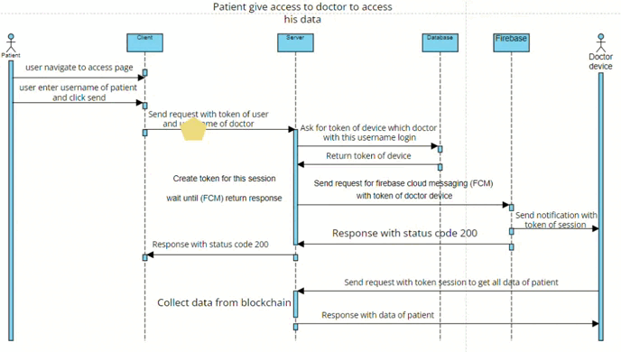
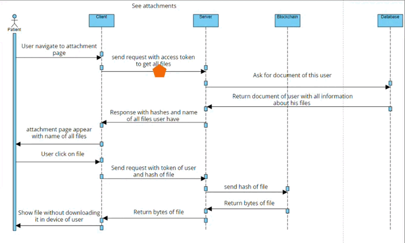
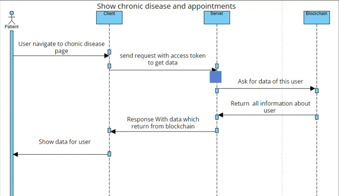
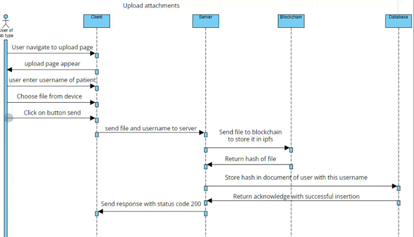

# EHR Data Manager Blockchain-Based Project (Rosheta)

## Overview
The EHR Data Manager Blockchain-Based project is a cutting-edge solution designed to revolutionize electronic health record (EHR) management. Leveraging blockchain technology, this platform offers a secure, transparent, and efficient way to store, share, and verify EHRs. From signing up and logging in to accessing medical records and handling emergencies, this system streamlines healthcare data management, ensuring data integrity and privacy.

## Features
- **User Registration**: Securely register new users on the blockchain and database.
- **Authentication**: Log in using blockchain enrollment, hashed passwords, and JWT token authorization.
- **Profile Management**: View and manage personal profiles, including search and chat functionalities.
- **Medical Record Access**: Access and view medical records securely.

- **Record Addition**: Doctors can add new medical records to the system.
- **File Upload**: Users can upload files securely.
- **File Display**: View uploaded files and attachments.

- **Emergency Handling**: Manage emergency situations efficiently.

## Installation
### Prerequisites
Ensure you have Node.js and npm installed on your system.

### Steps
1. Clone the repository: `git clone https://github.com/Rosheta/backend.git`
2. Navigate to the project directory: `cd backend`
3. Install dependencies: `npm install`
4. Configure environment variables as per the `.env` file.
5. Run the project: `npm start`

## Usage
- **Sign Up**: Users can sign up by visiting the registration page and filling out the required information.
- **Login & Enroll**: Upon successful login, users are enrolled in the blockchain, their password is hashed, and a JWT token is generated for authorization.
- **Profile & Search**: Users can view their profiles, search for specific information, and engage in chat sessions.
- **Medical Records**: Access medical records securely through the platform.

- **Doctor Add Record**: Doctors can add new medical records to the system, ensuring accurate and timely updates.
- **Upload File**: Users can upload files securely, enhancing the accessibility of medical documents and records.

- **Show Files**: View uploaded files and attachments, facilitating easy access to critical information.
- **Emergency**: Manage emergency situations efficiently, ensuring prompt and effective response.

## Contributing
We welcome contributions to the EHR Data Manager project. Please review the Contributing Guidelines for details on how to submit changes.

## License
This project is licensed under the GNU General Public License, See the [LICENSE file](https://github.com/Rosheta/.github/blob/main/profile/COPYING.md) for details.
